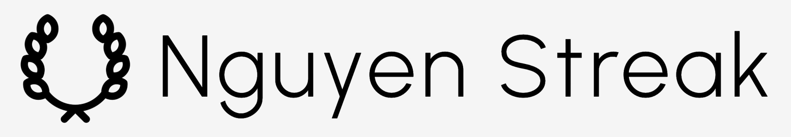
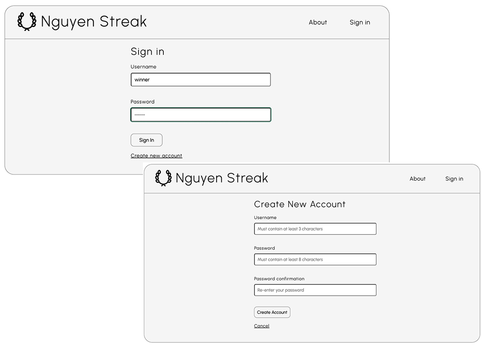
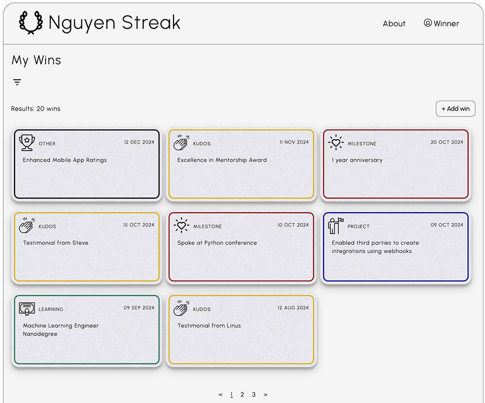
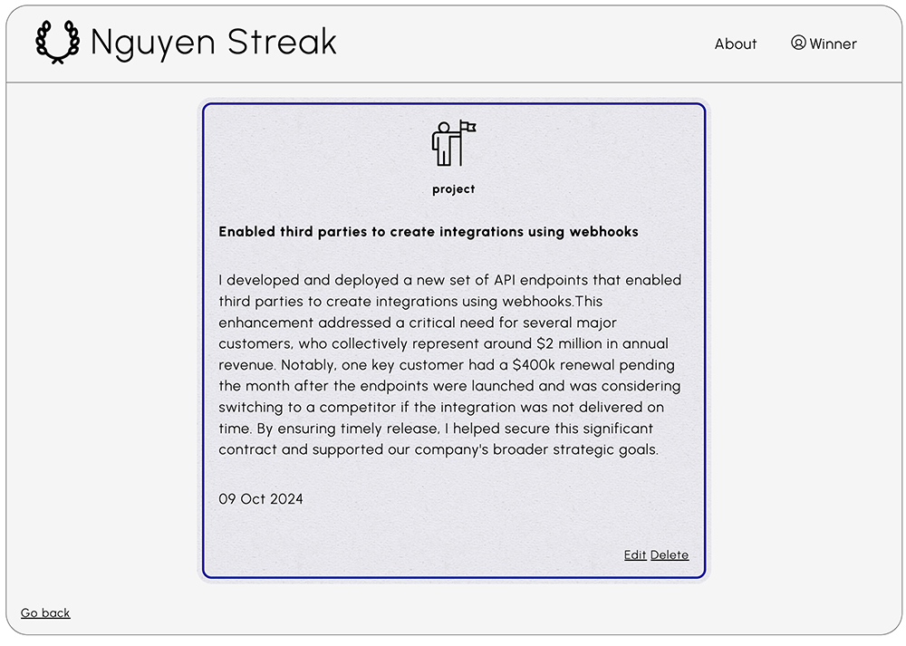
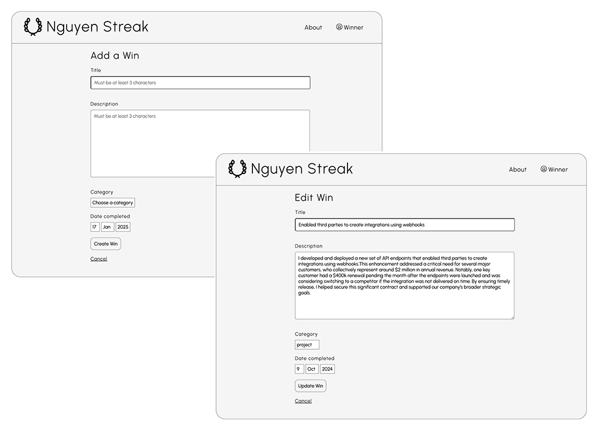
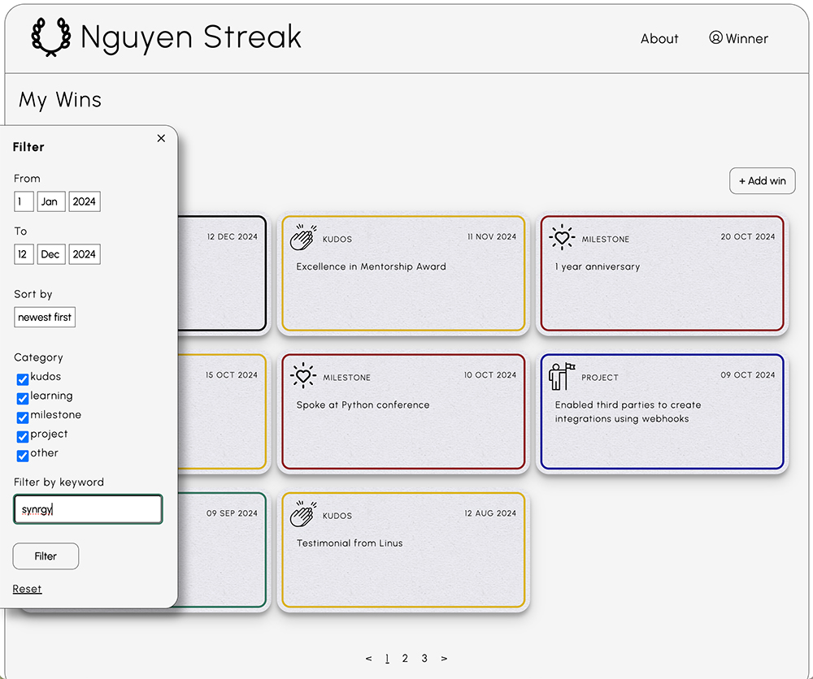
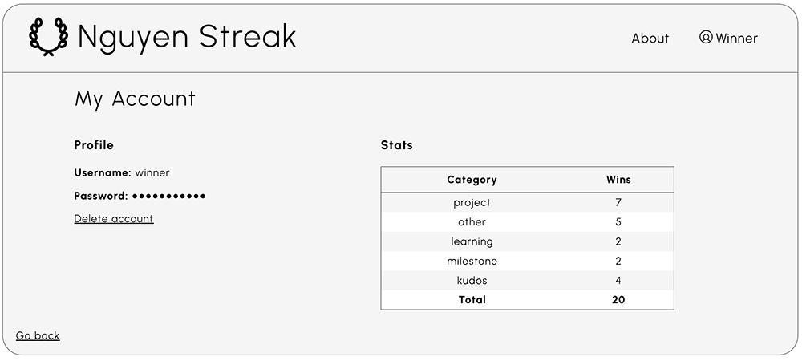

<!-- TABLE OF CONTENTS -->
<details>
  <summary>Table of Contents</summary>
  <ol>
    <li>
      <a href="#what-is-nguyen-streak">What is Nguyen Streak?</a>
    </li>
    <li>
      <a href="#getting-started">Getting Started</a>
    </li>
    <li>
      <a href="#how-to-use-nguyen-streak">How to Use Nguyen Streak</a>
    </li>
    <li>
      <a href="#credits">Credits</a>
    </li>
  </ol>
</details>

## What is Nguyen Streak?

**Nguyen Streak is a fully-responsive, fullstack Rails app. It's a tool to track your accomplishments.**

If you were up for a big promotion, who would you want to be your hypeman? Your boss? Your best friend? Or someone else?

Your boss or bestie might be lovely people, but when it comes to advocating for yourself, the best advocate for you is *you*. No one knows your work as well as you do. But when you sit down to update your resumé or write a performance review, it can be hard to remember everything that you've accomplished in the last quarter or the last year, much less the last few years.

Instead of digging through stacks of old emails, documents, and DMs, Nguyen Streak makes it easier to keep all your accomplishments in one place.

(If you're wondering, it's pronounced [win strēk])

**Built with:**
* [![Ruby][Ruby]][Ruby-url]
* [![Rails][Rails]][Rails-url]
* [![JavaScript][JavaScript]][JavaScript-url]
* [![SQLite][SQLite]][SQLite-url]
* ![HTML5][HTML5]
* ![CSS][CSS]
* bcrypt and Pagy Ruby gems
- Icons from [The Noun Project](https://thenounproject.com)

## Getting Started

### 1. Install Ruby/Rails/SQLite3

#### Install Ruby
Verify that you have Ruby installed:
```
$ ruby --version
```
You will need Ruby 3.2.2. If you don't have Ruby, you can find [installation instructions in the offical Ruby documentation](https://www.ruby-lang.org/en/documentation/installation/).

#### Install SQLite3
Verify that you have SQLite3 installed:
```
$ sqlite3 --version
```
You can find [installation instructions for SQLite3 on sqlite.org](https://www.sqlite.org))

#### Install Rails 

To install Rails, use the `gem install` command provided by RubyGems:
```
$ gem install rails
```

### 2. Run the program

If you want to check out the demo user account, seed the database with sample data.
```
rails db:seed
```

Start the server by running this command from the program directory:
```
$ rails server
```

### 3. Open a browser window and navigate to http://localhost:3000.


## How to Use Nguyen Streak

### Sign in or Create an Account

To use Nguyen Streak, you'll need to sign in using the demo user credentials or you can create your own account. The demo user account already has some wins saved. Passwords are encrypted using the bcrypt Ruby gem.

```
Demo credentials:

username: winner
password: password123
```



---

### View Your Wins

If you have any wins saved, you'll see them displayed as cards on the homepage. Results are paginated and will display up to eight wins at at time. The number of results for the current filter are displayed at the top of the screen. By default, the filter results will include all your wins, ordered by date (newest to oldest), then alphabetically by title.

Navigate through each page of filtered wins by clicking on the arrows in the win navigation menu.



Click on any card to see more details and to access the edit and delete buttons for that win. 



---

### Add or Edit Your Wins

You can add new wins or edit prexisting ones. For each win, you can add a title, description, date, and choose a category (kudos, learning, milestone, project, other).



---

### Filter Your Wins

You can filter your wins by:
- Date range
- Category
- Keyword



---

### View Your Account Summary

You can see a high-level summary of your wins by category and your account profile information.



## Credits

**Nguyen Streak** was built by Tram Nguyen.

<!-- MARKDOWN LINKS & IMAGES -->
[Ruby]: https://img.shields.io/badge/Ruby-CC342D?style=for-the-badge&logo=ruby&logoColor=white
[Ruby-url]: https://ruby-lang.org/

[Rails]: https://img.shields.io/badge/Rails-D30001?style=for-the-badge&logo=rubyonrails&logoColor=white
[Rails-url]: https://rubyonrails.org/

[JavaScript]: https://img.shields.io/badge/javascript-F7DF1E?style=for-the-badge&logo=rubyonrails&logoColor=black
[JavaScript-url]: https://developer.mozilla.org/en-US/docs/Web/JavaScript/Guide

[SQLite]: https://img.shields.io/badge/SQLite-003B57?style=for-the-badge&logo=sqlite&logoColor=white
[SQLite-url]: https://sqlite.org/

[HTML5]: https://img.shields.io/badge/HTML-E34F26?style=for-the-badge&logo=html5&labelColor=%23E34F26&color=%23E34F26

[CSS]: https://img.shields.io/badge/CSS3-1572B6?style=for-the-badge&logo=css3&logoColor=white&labelColor=%231572B6&color=%231572B6
