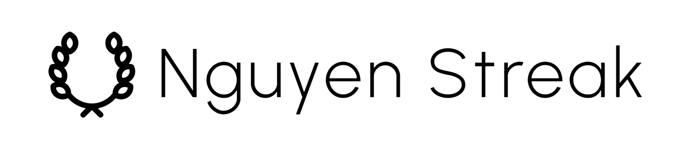

# Nguyen Streak - A Win Tracker

## Description



### Who is your biggest fan?

If you were up for a big promotion, who would you want to be your hypeman? Your boss? Your best friend? Or someone else?

Your boss or bestie might be lovely people, but when it comes to advocating for yourself, the best advocate for you is *you*. No one knows your work as well as you do. But when you sit down to update your resumé or write a performance review, it can be hard to remember everything that you've accomplished in the last quarter or the last year, much less the last few years.

### What is Nguyen Streak?

**Nguyen Streak** is an app to track your wins. Instead of digging through stacks of old emails, documents, and DMs, Nguyen Streak makes it easier to keep all your accomplishments in one place.


**Nguyen Streak was built using:**
- Ruby
- Rails
- JavaScript
- Icons from [The Noun Project](https://thenounproject.com)

### How do you pronounce Nguyen Streak?

It's pronounced [win strēk]. 😊

## Table of Contents

- [Installation](#installation)
- [Usage](#usage)
- [Credits](#credits)

## Installation

### 1. Install Ruby/Rails/SQLite3

#### Install Ruby
Verify that you have Ruby installed:
```
$ ruby --version
```
You will need Ruby 3.2.2. If you don't have Ruby, you can find [installation instructions on the offical Ruby documentation](https://www.ruby-lang.org/en/documentation/installation/).

#### Install SQLite3
Verify that you have SQLite3 installed:
```
$ sqlite3 --version
```
You can find [installation instructions for SQLite3 on sqlite.org](https://www.sqlite.org))

#### Install Rails 

To install Rails, use the gem install command provided by RubyGems:
```
$ gem install rails
```

### Run the program

Start the server by running this command from the program directory:
```
$ bin/rails server
```

To see **Nguyen Streak**, open a browser window and navigate to http://localhost:3000.

## Usage

### Sign in or Create an Account

To access **Nguyen Streak**, you'll need to be signed in. You won't be able to access any pages or perform any actions until you are signed in.*


You can use the demo user credentials or create your own account.

```
username: demo
password: password
```

---

### View Your Wins

If you have any wins saved, you'll see them displayed on your homepage (up to eight at a time). At the top, you'll see the number of results for the current filter. By default, the filter results will include all your wins, ordered by date (newest to oldest), then alphabetically by title.

Navigate through each page of filtered wins by clicking on the arrows in the bottom navigation menu.


Click on any card to see more details and to access the edit and delete buttons for that win. 


---

### Filter Your Wins


You can filter your wins by:
- Date range
- Category
- Keyword

---

### Add or Edit Your Wins


Add new wins or edit prexisting ones.

---

### View or Edit Your Account


You can see a high-level overview of your wins by category and your account profile information.

## Credits

**Nguyen Streak** was built by Tram Nguyen.
